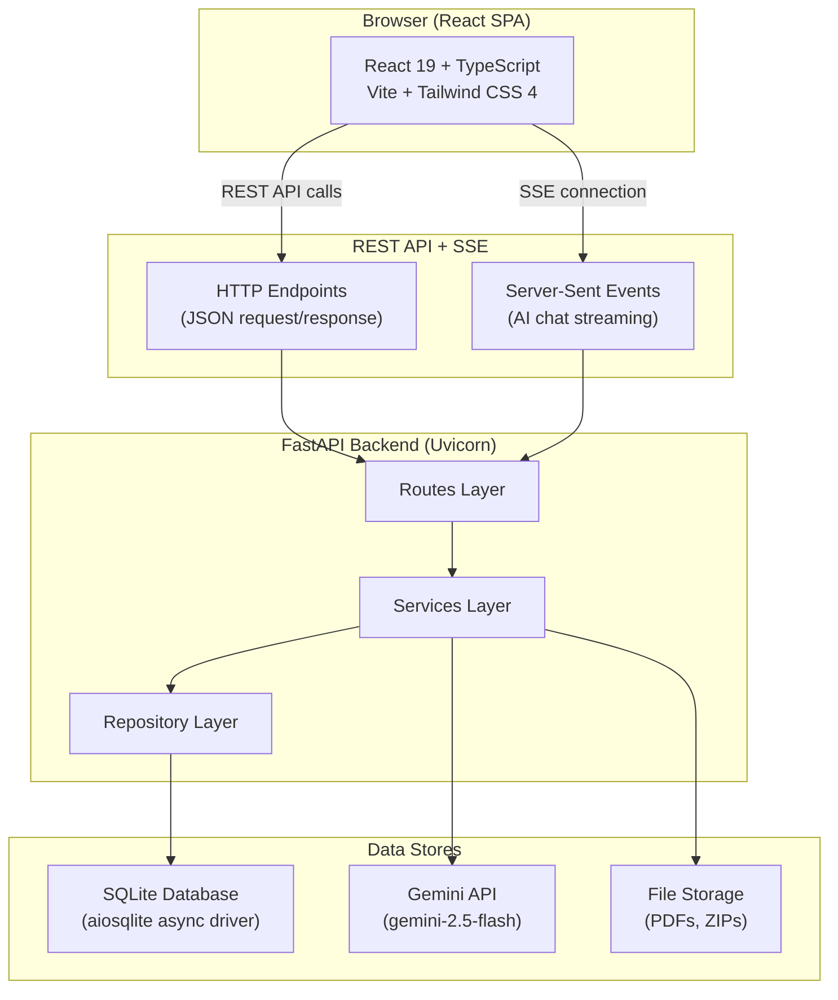
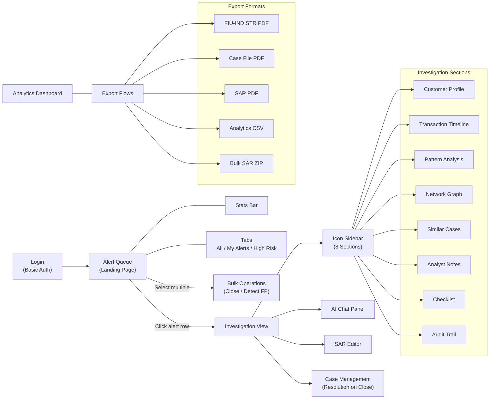
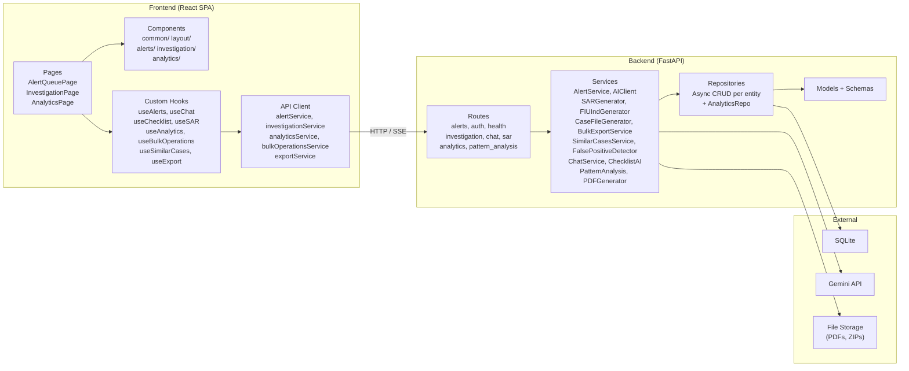

# AML Sentinel -- Architecture Overview

## Project Overview

AML Sentinel is an AI-powered Anti-Money Laundering (AML) Alert Investigation Assistant built for banking compliance teams. It provides analysts with a comprehensive investigation workbench to triage, investigate, and resolve 20 synthetic alerts across 6 money laundering typologies.

**Core capabilities:**

- **Alert Queue** with bulk operations, tabs (All / My Alerts / High Risk), filter pills, and numbered pagination
- **Investigation Workbench** with an 8-section icon sidebar (Customer Profile, Transaction Timeline, Pattern Analysis, Network Graph, Similar Cases, Analyst Notes, Checklist, Audit Trail)
- **AI Chat** powered by Gemini (gemini-2.5-flash) with real-time SSE streaming
- **Pattern Analysis** with AI-generated risk indicators
- **SAR/STR Generation** with version history and multiple PDF export formats
- **Analytics Dashboard** with summary cards, typology distribution, resolution breakdown, risk distribution, alert volume trends, and false positive trends
- **Similar Case Matching** to identify related alerts by typology, risk, and transaction patterns
- **Multi-format Export** -- FIU-IND STR PDF, case file PDF, SAR PDF, analytics CSV, bulk SAR ZIP

The UI follows the Datadog design philosophy -- a data-dense, functional investigation workbench optimized for analysts who work in compliance tooling 8 hours a day.

---

## System Architecture

---

## User Flow

### Detailed User Journey

1. **Login** -- Analyst authenticates with hardcoded credentials (basic auth, no registration). Three predefined analysts are available.

2. **Alert Queue (Landing Page)** -- Displays a compact stats bar (open alerts, high-risk count, average resolution time) above a dense, sortable, filterable table of 20 alerts. The queue includes:
   - **Tabs:** All Alerts / My Alerts / High Risk -- to segment the queue
   - **Filter Pills:** Typology multi-select, status, risk range, date range, resolution, assigned analyst, and text search
   - **Bulk Selection:** Checkboxes on each row with a BulkActionBar for batch operations (bulk close, detect false positives)
   - **Numbered Pagination:** Page-based navigation with numbered page buttons

3. **Investigation View** -- Clicking an alert row navigates to a detail view with an 8-section icon sidebar (vertical icon navigation, not tabs) for maximum screen real estate:
   - **Customer Profile** -- Organized card grid showing customer and account details
   - **Transaction Timeline** -- Scatter chart (Recharts, color-coded by flag status) plus a dense sortable transaction table with INR formatting
   - **Pattern Analysis** -- AI-generated structured cards with risk indicators
   - **Network Graph** -- Interactive force-directed graph (react-force-graph-2d) with nodes colored by risk and hover tooltips
   - **Similar Cases** -- Up to 5 similar alerts ranked by similarity score, based on typology, risk score, transaction amounts, and customer risk
   - **Analyst Notes** -- Chronological investigation notes
   - **Checklist** -- Per-typology checklist items with AI auto-check capability and rationale
   - **Audit Trail** -- Chronological log of all actions taken on the alert
   - **InvestigationHeader** with export button (download case file PDF)

4. **AI Chat Panel** -- Streaming conversation (SSE) with Gemini, referencing real transaction data for the alert under investigation. Real-time token streaming provides a responsive conversational experience.

5. **Investigation Checklist** -- Per-typology checklist items with AI auto-check capability. Each item receives a rationale explaining the AI assessment.

6. **SAR Generation** -- Generate a SAR draft (5 narrative sections: subject information, suspicious activity description, relationship to institution, supporting documentation, narrative summary). Edit in-app, view version history, and download as:
   - **SAR PDF** -- Professional narrative format
   - **FIU-IND STR PDF** -- Regulatory Suspicious Transaction Report format for FIU-India

7. **Case Management** -- Status transitions follow a defined workflow:
   - **Statuses:** New -> In Progress -> Review -> Escalated -> Closed
   - **Resolution on Close:** When closing an alert, the analyst must select a resolution (Confirmed Suspicious / No Suspicion / Insufficient Evidence / Referred to Law Enforcement)
   - Confirmation modal with rationale input and full audit trail

8. **Analytics Dashboard** -- Accessible from the sidebar navigation. Provides visual oversight of alert activity:
   - **Summary Cards** -- High-level KPIs (total alerts, open, closed, average risk)
   - **Typology Bar Chart** -- Alert counts by AML typology
   - **Resolution Donut Chart** -- Closed alert counts by resolution outcome
   - **Risk Distribution Chart** -- Alert counts bucketed by risk score ranges
   - **Alert Volume Trend Chart** -- Daily alert counts over time
   - **False Positive Trend Chart** -- Weekly false positive rates
   - **CSV Export** -- Download analytics data as a CSV file

9. **Similar Cases** -- Up to 5 similar alerts ranked by a computed similarity score. Matching criteria include typology, risk score, transaction amounts, and customer risk profile. Helps analysts identify patterns across related alerts.

10. **Bulk Operations** -- Efficiency features for high-volume alert processing:
    - **Bulk Close** -- Select multiple alerts and close them with a shared resolution and rationale
    - **False Positive Detection** -- AI-powered analysis of selected alerts for false positive indicators, providing confidence scores and reasoning

11. **Export** -- Multiple document formats serve different compliance workflows:
    - **FIU-IND STR PDF** -- Regulatory Suspicious Transaction Report for FIU-India filing
    - **Case File PDF** -- Comprehensive investigation case file with all sections
    - **SAR PDF** -- Professional narrative Suspicious Activity Report
    - **Analytics CSV** -- Tabular export of analytics dashboard data
    - **Bulk SAR ZIP** -- Multiple STR PDFs packaged as a ZIP archive for batch filing

---

## Key Design Decisions

| Decision | Rationale |
|----------|-----------|
| **SQLite database** | Simplicity -- zero infrastructure, single-file database, ideal for a demonstration system with 20 alerts |
| **Basic auth with hardcoded analysts** | No registration flow needed; analysts are predefined for this investigative tool |
| **Alert Queue as landing page** | Analysts land directly on actionable work |
| **Gemini API (gemini-2.5-flash)** | AI features (pattern analysis, chat, checklist auto-check, SAR generation, false positive detection) use Google Generative AI -- no mocks in production or AI integration tests |
| **Icon sidebar over tabs** | 8 investigation sections accessible via a compact vertical icon sidebar -- provides more screen real estate than horizontal tabs |
| **Multiple PDF formats** | SAR narrative, FIU-IND STR (regulatory format), case file (comprehensive) -- each serves a different compliance workflow |
| **Analytics dashboard** | Visual oversight of alert volumes, typology distribution, resolution outcomes, and false positive trends |
| **Bulk operations** | Efficiency for high-volume alert processing -- bulk close with resolution, batch false positive detection with AI |
| **Similar case matching** | Helps analysts identify patterns across alerts using typology, risk score, transaction amounts, and customer risk profile |
| **Resolution tracking** | Closed alerts track outcome (Confirmed Suspicious, No Suspicion, Insufficient Evidence, Referred to Law Enforcement) for audit and analytics |
| **Datadog-style UI** | Data-dense, functional design optimized for power users in compliance teams |
| **SSE for chat streaming** | Server-Sent Events provide real-time token streaming from Gemini without WebSocket complexity |

---

## Typologies Covered

AML Sentinel supports investigation of alerts across 6 money laundering typologies:

| # | Typology | Alert IDs | Description |
|---|----------|-----------|-------------|
| 1 | **Structuring** | S1--S5 | Deliberately breaking large transactions into smaller amounts below reporting thresholds (e.g., multiple cash deposits just under the regulatory limit) to avoid triggering Currency Transaction Reports |
| 2 | **Unusual Geographic Activity** | G1--G3 | Transactions involving high-risk jurisdictions or geographic patterns inconsistent with the customer's profile, such as sudden wire transfers to countries with weak AML controls |
| 3 | **Rapid Fund Movement** | R1--R3 | Funds moving quickly through accounts with minimal holding time -- money enters and exits within hours or days, suggesting the account is used as a pass-through rather than for legitimate banking |
| 4 | **Round-trip Transactions** | RT1--RT3 | Funds sent to an external entity and returned to the originator (or a related party) in a circular pattern, often used to create a false paper trail or simulate legitimate business activity |
| 5 | **Sudden Activity Change** | SA1--SA3 | A dormant or low-activity account that suddenly exhibits a dramatic increase in transaction volume or value, inconsistent with the customer's historical behavior and stated income |
| 6 | **Large Cash Transactions** | LC1--LC3 | Cash deposits or withdrawals of unusually large amounts that are inconsistent with the customer's profile, business type, or stated source of funds |

Total: **20 synthetic alerts** across these 6 typologies, each with full customer profiles, account details, and realistic transaction histories.

---

## Component Boundaries

---

## Deployment Model

AML Sentinel runs as two local processes during development:

- **Backend:** `uvicorn api.main:app --reload` at `http://localhost:8001`
- **Frontend:** `vite dev` at `http://localhost:5174`

The backend serves the REST API and SSE endpoints. The frontend is a Vite-powered React SPA that communicates with the backend via HTTP. CORS is configured to allow the frontend origin. SQLite stores all data in a single file (`backend/aml_sentinel.db`). Generated PDFs and ZIP archives are written to local file storage.

No containerization (Docker) is required. The system is designed for local development and demonstration purposes.
