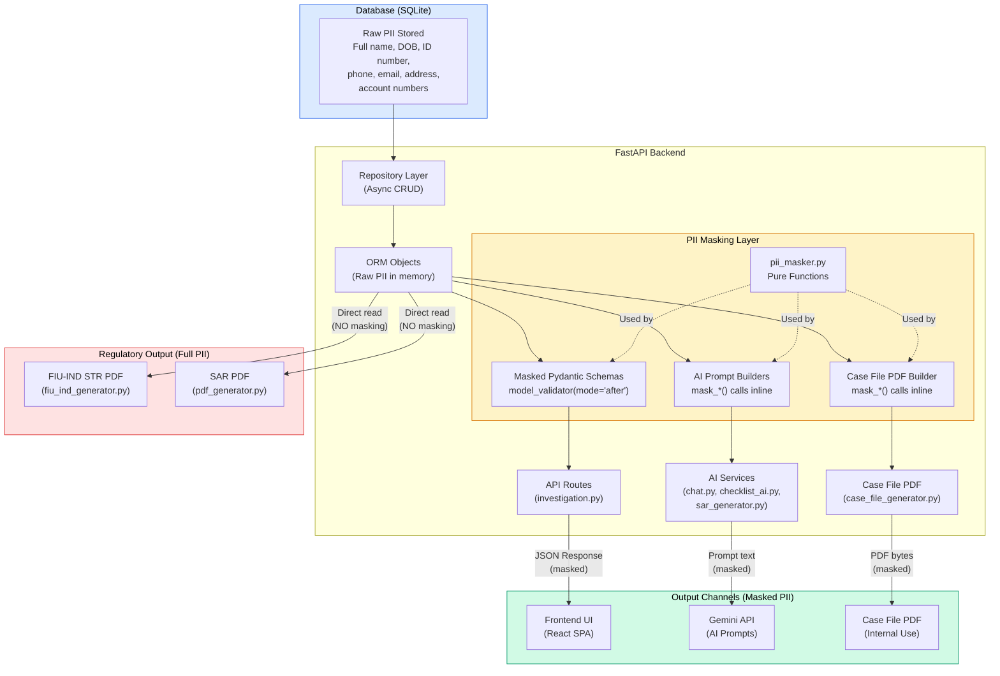
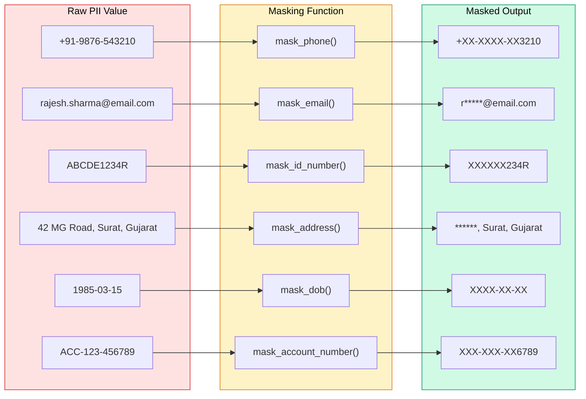
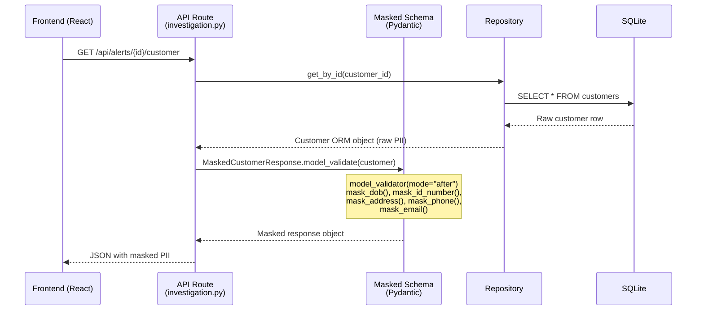
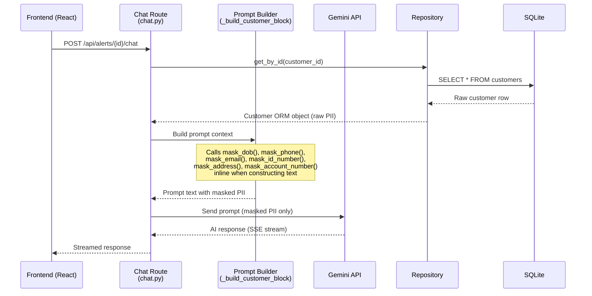
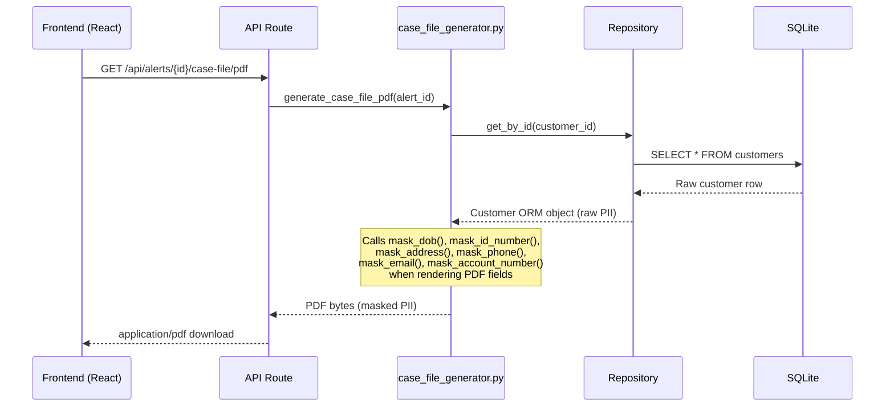
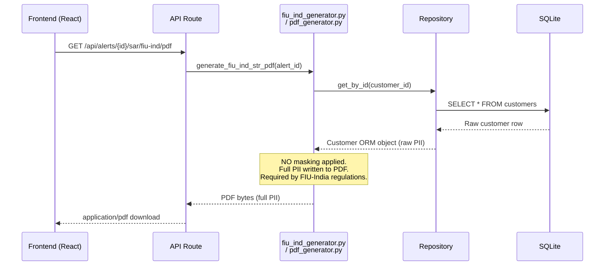
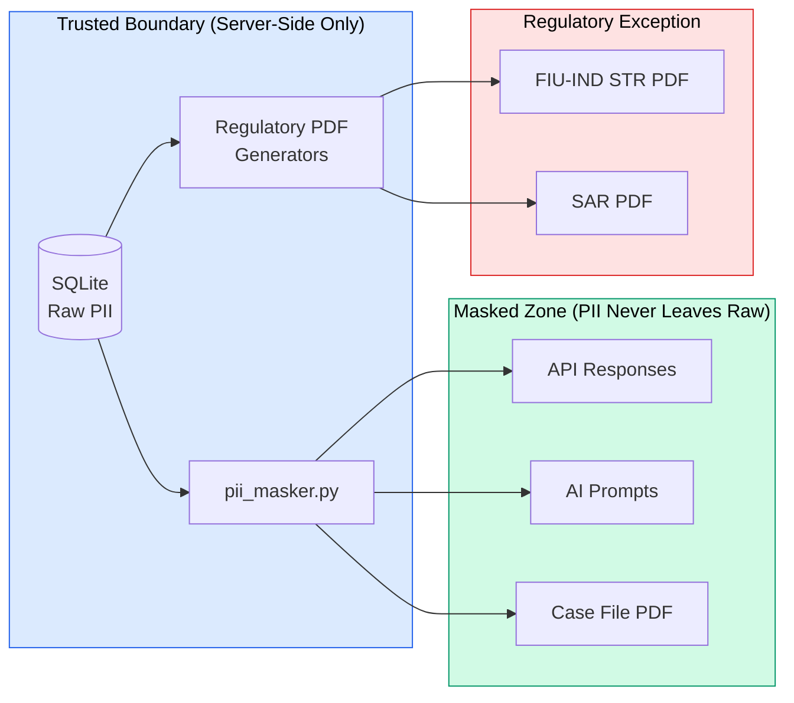

# PII Masking Architecture — DPDP Act 2023 Compliance

## Approach: Server-Side Data Masking (Not Tokenization)

AML Sentinel uses **server-side data masking** — not tokenization. The distinction matters:

| Technique | How It Works | Reversible? | Used Here? |
|-----------|-------------|-------------|------------|
| **Tokenization** | Replaces real data with a random token, stores the original in a secure vault. The token can be de-tokenized to recover the original value. | Yes (via vault lookup) | No |
| **Data Masking** | Irreversibly transforms PII by replacing characters with mask symbols (`X`, `*`). The original value is never stored separately — it exists only in the database. | No | Yes |

AML Sentinel chose data masking because:

1. **No de-masking needed** — analysts do not need to see raw PII (DOB, full ID number, phone) during investigation. Full name is intentionally unmasked.
2. **Simpler architecture** — no token vault, no extra storage, no key management.
3. **DPDP Act compliance** — the Act requires minimizing PII exposure in processing; masking achieves this without the overhead of a tokenization layer.
4. **Regulatory exception** — FIU-IND STR and SAR PDFs bypass masking entirely and read raw PII directly from the database, as required by law.

---

## Where Masking Happens

Masking is applied at the **backend service layer** — after data is read from the database but before it reaches any output channel (API response, AI prompt, or PDF).

---

## Masking Rules

All masking is performed by pure functions in `backend/api/core/pii_masker.py`. Each function handles `None` gracefully (returns `None`).

**Intentionally NOT masked:**

| Field | Reason |
|-------|--------|
| Full Name | Required for analyst identity confirmation during investigation |
| Counterparty Name | Required for transaction pattern analysis and network graph |

---

## Three Masking Mechanisms

The masking layer uses three distinct mechanisms depending on the output channel:

```mermaid
flowchart TD
    subgraph MECHANISM_1["Mechanism 1: Pydantic Model Validators"]
        direction TB
        M1_DESC["Used by: API Routes → Frontend"]
        M1_HOW["How: Masked Pydantic schemas<br/>(MaskedCustomerResponse,<br/>MaskedAccountResponse,<br/>MaskedTransactionResponse)<br/>apply masking in<br/>model_validator(mode='after')"]
        M1_WHEN["When: Masking runs automatically<br/>during serialization —<br/>no manual calls needed"]
    end

    subgraph MECHANISM_2["Mechanism 2: Inline mask_*() Calls in Prompt Builders"]
        direction TB
        M2_DESC["Used by: AI Services → Gemini"]
        M2_HOW["How: Prompt-building helper functions<br/>call mask_phone(), mask_email(), etc.<br/>when constructing text blocks<br/>sent to Gemini API"]
        M2_FILES["Files:<br/>chat.py — _build_customer_block(),<br/>_build_accounts_block(),<br/>_build_network_block()<br/>checklist_ai.py — _build_customer_profile_block(),<br/>_build_account_block()<br/>sar_generator.py — account lines"]
    end

    subgraph MECHANISM_3["Mechanism 3: Inline mask_*() Calls in PDF Builder"]
        direction TB
        M3_DESC["Used by: Case File PDF Generator"]
        M3_HOW["How: case_file_generator.py calls<br/>mask_dob(), mask_id_number(), etc.<br/>when rendering customer profile<br/>and account tables into PDF"]
        M3_NOTE["Note: FIU-IND STR and SAR PDFs<br/>do NOT use this mechanism —<br/>they read raw PII directly"]
    end

    style MECHANISM_1 fill:#dbeafe,stroke:#2563eb,color:#000
    style MECHANISM_2 fill:#ede9fe,stroke:#7c3aed,color:#000
    style MECHANISM_3 fill:#d1fae5,stroke:#059669,color:#000
```

---

## Data Flow Per Output Channel

### Channel 1: Frontend UI (API Response)

### Channel 2: AI Prompt (Gemini API)

### Channel 3: Case File PDF (Internal)

### Channel 4: Regulatory PDFs (Full PII — No Masking)

---

## File Map

| File | Role in Masking |
|------|----------------|
| `api/core/pii_masker.py` | Foundation — 6 pure masking functions + 2 convenience wrappers |
| `api/schemas/customer.py` | `MaskedCustomerResponse` — masks DOB, ID, address, phone, email via `model_validator` |
| `api/schemas/account.py` | `MaskedAccountResponse` — masks account_number via `model_validator` |
| `api/schemas/transaction.py` | `MaskedTransactionResponse` — masks counterparty_account via `model_validator` |
| `api/routes/investigation.py` | Uses masked schemas for customer, transaction, and network graph endpoints |
| `api/services/chat.py` | Masks PII in prompt context blocks sent to Gemini |
| `api/services/checklist_ai.py` | Masks PII in checklist auto-check prompts sent to Gemini |
| `api/services/sar_generator.py` | Masks account numbers in SAR generation prompts sent to Gemini |
| `api/services/case_file_generator.py` | Masks PII in internal case file PDF output |
| `api/services/fiu_ind_generator.py` | **No masking** — regulatory filing requires full PII |
| `api/services/pdf_generator.py` | **No masking** — SAR PDF for regulatory filing requires full PII |

---

## Security Boundary Summary

Raw PII never crosses the trusted boundary into the masked zone. The only path where full PII reaches an output is the regulatory exception for FIU-IND STR and SAR PDF filings, which are legal requirements.
