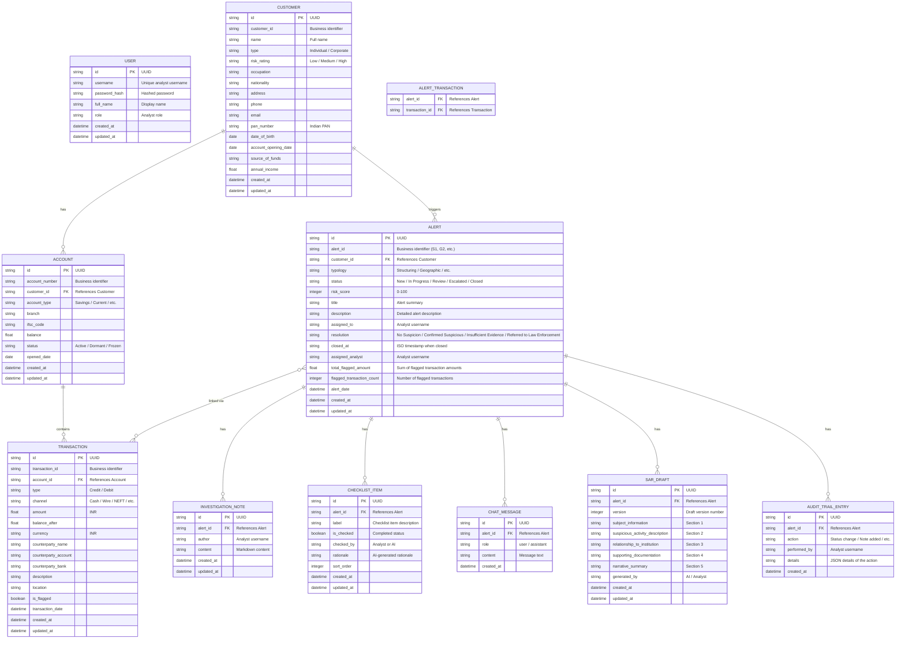

# AML Sentinel -- Technical Architecture

## Tech Stack

### Backend

| Technology | Version | Purpose |
|-----------|---------|---------|
| Python | 3.11+ | Runtime |
| FastAPI | latest | Web framework with async support |
| SQLAlchemy | async | ORM with async session management |
| aiosqlite | latest | Async SQLite driver |
| Alembic | latest | Database migrations (SQLite dialect) |
| Pydantic | v2 | Request/response schema validation |
| pydantic-settings | latest | Environment-based configuration |
| Google Generative AI SDK | latest | Gemini API client (gemini-2.5-flash) |
| ReportLab | latest | PDF generation (SAR, FIU-IND STR, case file) |
| Uvicorn | standard | ASGI server |

### Frontend

| Technology | Version | Purpose |
|-----------|---------|---------|
| React | 19 | UI library |
| TypeScript | ~5.9 | Type-safe JavaScript |
| Vite | 7 | Build tool and dev server |
| Tailwind CSS | 4 | Utility-first CSS framework |
| Recharts | 3 | Chart library (transaction timeline, analytics charts) |
| react-force-graph-2d | 1.29+ | Network graph visualization |
| react-router-dom | 7 | Client-side routing |
| lucide-react | 0.575+ | Icon library for sidebar and UI elements |
| Vitest | 4 | Test runner |
| React Testing Library | 16 | Component testing utilities |

---

## Backend Architecture


### Backend Layer Responsibilities

| Layer | Responsibility | Pattern |
|-------|---------------|---------|
| **Routes** | HTTP request handling, request validation, response serialization | One router per domain; thin controllers delegating to services |
| **Services** | Business logic, orchestration, AI prompt construction, PDF generation | Domain services encapsulating use cases; no direct DB access |
| **Repositories** | Database queries, async CRUD operations, analytics aggregation | One repository per entity; SQLAlchemy async queries |
| **Models** | Database table definitions, relationships | SQLAlchemy declarative models with UUID primary keys and timestamp mixins |
| **Schemas** | API contract definitions, validation | Pydantic v2 models for request/response; separate from ORM models |

---

## Frontend Architecture


### Frontend Layer Responsibilities

| Layer | Responsibility | Pattern |
|-------|---------------|---------|
| **Pages** | Top-level route components, layout composition | One page per route; composes domain components |
| **Components** | UI rendering, user interaction | Domain-grouped folders; functional components with typed props |
| **Hooks** | Data fetching, state management, side effects | Custom hooks wrapping API calls; return loading/error/data states |
| **Services** | HTTP communication, request/response transformation | Typed API client; handles JSON serialization, SSE connections, and file downloads |
| **Types** | TypeScript interfaces and type definitions | One file per domain entity; strict mode with no `any` types |

---

## Database Schema



### Key Schema Notes

- All primary keys are UUIDs (string, 36 chars) generated via Python `uuid.uuid4()`.
- All entities include `created_at` and `updated_at` timestamps (UTC) via the `TimestampMixin`.
- The `alert_transactions` junction table enables a many-to-many relationship between alerts and the specific transactions that triggered them.
- The `User` table stores hardcoded analyst credentials; no registration endpoint exists.
- The `Alert` entity includes `resolution` and `closed_at` fields for tracking investigation outcomes and closure timestamps.
- The `Alert` entity includes computed fields (`total_flagged_amount`, `flagged_transaction_count`) for analytics and similar case matching.
- SQLite is the sole database backend. The connection string is `sqlite+aiosqlite:///./aml_sentinel.db`. Tests use a separate in-memory or temporary file instance.

---

## API Endpoints

### Authentication

| Method | Endpoint | Description |
|--------|----------|-------------|
| `POST` | `/api/auth/login` | Authenticate analyst with username/password; returns session token |
| `POST` | `/api/auth/logout` | Invalidate the current session |
| `GET` | `/api/auth/me` | Return the currently authenticated analyst's profile |

### Alert Queue

| Method | Endpoint | Description |
|--------|----------|-------------|
| `GET` | `/api/alerts` | List alerts with filtering (typology, status, risk range, date range, resolution, assigned analyst, text search), sorting, and pagination |
| `GET` | `/api/alerts/{id}` | Get full details of a single alert |
| `GET` | `/api/alerts/stats` | Summary statistics for alert queue dashboard |
| `GET` | `/api/alerts/by-alert-id/{alert_id}` | Fetch alert by short identifier (S1, G2, etc.) |
| `PATCH` | `/api/alerts/{id}/status` | Transition alert status with rationale and optional resolution |
| `POST` | `/api/alerts/bulk-close` | Close multiple alerts with resolution and rationale |
| `POST` | `/api/alerts/detect-false-positives` | AI analysis of alerts for false positive indicators |

### Investigation Data

| Method | Endpoint | Description |
|--------|----------|-------------|
| `GET` | `/api/alerts/{id}/customer` | Customer profile and account details for the alert's subject |
| `GET` | `/api/alerts/{id}/transactions` | Transaction history for the alert with filtering and sorting |
| `GET` | `/api/alerts/{id}/network` | Network graph data (nodes and edges) for the alert's transaction network |
| `GET` | `/api/alerts/{id}/similar-cases` | Up to 5 similar alerts ranked by similarity score |
| `GET` | `/api/alerts/{id}/case-file/pdf` | Download comprehensive investigation case file PDF |

### AI-Powered Features

| Method | Endpoint | Description |
|--------|----------|-------------|
| `POST` | `/api/alerts/{id}/pattern-analysis` | Generate AI pattern analysis for the alert's transactions |
| `POST` | `/api/alerts/{id}/chat` | Send a message and receive AI response via SSE streaming |
| `POST` | `/api/alerts/{id}/checklist/auto-check` | AI auto-evaluation of checklist items with rationale |

### SAR (Suspicious Activity Report)

| Method | Endpoint | Description |
|--------|----------|-------------|
| `POST` | `/api/alerts/{id}/sar/generate` | Generate a new SAR draft using AI (5 narrative sections) |
| `GET` | `/api/alerts/{id}/sar` | Retrieve the current SAR draft and version history |
| `PATCH` | `/api/alerts/{id}/sar/{draft_id}` | Apply manual edits to a SAR draft |
| `GET` | `/api/alerts/{id}/sar/pdf` | Download the SAR as a professional narrative PDF |
| `GET` | `/api/alerts/{id}/sar/{draft_id}/pdf` | Download specific SAR draft as PDF |
| `GET` | `/api/alerts/{id}/str/pdf` | Download FIU-IND Suspicious Transaction Report PDF |
| `POST` | `/api/sar/bulk-export` | Export multiple STR PDFs as ZIP archive |

### Case Management

| Method | Endpoint | Description |
|--------|----------|-------------|
| `PATCH` | `/api/alerts/{id}/status` | Transition alert status (with rationale and optional resolution); records audit trail entry |
| `GET` | `/api/alerts/{id}/audit-trail` | Chronological audit trail of all actions on the alert |

### Investigation Notes

| Method | Endpoint | Description |
|--------|----------|-------------|
| `GET` | `/api/alerts/{id}/notes` | List all investigation notes for the alert (chronological) |
| `POST` | `/api/alerts/{id}/notes` | Add a new investigation note |

### Analytics

| Method | Endpoint | Description |
|--------|----------|-------------|
| `GET` | `/api/analytics/overview` | High-level dashboard statistics |
| `GET` | `/api/analytics/alerts-by-typology` | Alert counts by AML typology |
| `GET` | `/api/analytics/resolution-breakdown` | Closed alert counts by resolution |
| `GET` | `/api/analytics/risk-distribution` | Alert counts bucketed by risk score |
| `GET` | `/api/analytics/alert-volume-trend` | Daily alert counts for trend chart |
| `GET` | `/api/analytics/false-positive-trend` | Weekly false positive rates |
| `GET` | `/api/analytics/export/csv` | Download analytics data as CSV |

### System

| Method | Endpoint | Description |
|--------|----------|-------------|
| `GET` | `/api/health` | Health check endpoint returning system status |

---

## File Structure

```
AMLSentinel/
├── architecture.md                  # High-level architecture overview
├── technical-architecture.md        # Technical deep-dive (this file)
├── CLAUDE.md                        # AI assistant instructions + design system
├── README.md                        # Project documentation
├── .env.example                     # Environment variable template
├── .gitignore                       # Git ignore rules
├── Makefile                         # Development commands (seed, test, run)
│
├── backend/
│   ├── pyproject.toml               # Python project config, dependencies, pytest/coverage settings
│   ├── alembic.ini                  # Alembic migration configuration
│   ├── aml_sentinel.db              # SQLite database file (generated)
│   │
│   ├── alembic/
│   │   └── versions/                # Database migration scripts
│   │
│   └── api/
│       ├── __init__.py
│       ├── main.py                  # FastAPI application factory
│       │
│       ├── core/                    # Application core infrastructure
│       │   ├── __init__.py
│       │   ├── config.py            # Pydantic settings (env-based configuration)
│       │   ├── database.py          # Async engine, session factory, get_async_session
│       │   └── auth.py              # Basic auth with hardcoded analysts
│       │
│       ├── models/                  # SQLAlchemy ORM models
│       │   ├── __init__.py
│       │   ├── base.py              # DeclarativeBase, TimestampMixin, UUIDPrimaryKeyMixin
│       │   ├── customer.py          # Customer model
│       │   ├── account.py           # Account model
│       │   ├── transaction.py       # Transaction model
│       │   ├── alert.py             # Alert model + alert_transactions junction (with resolution, closed_at)
│       │   └── investigation.py     # Note, ChecklistItem, ChatMessage, SARDraft, AuditTrail
│       │
│       ├── schemas/                 # Pydantic request/response schemas
│       │   ├── __init__.py
│       │   ├── auth.py              # Login request/response schemas
│       │   ├── alert.py             # Alert schemas (list, detail, filters, bulk ops, stats)
│       │   ├── analytics.py         # Analytics schemas (overview, typology, resolution, risk, trends)
│       │   ├── customer.py          # Customer schemas
│       │   ├── account.py           # Account schemas
│       │   ├── transaction.py       # Transaction schemas
│       │   └── investigation.py     # Note, checklist, chat, SAR, audit, similar cases schemas
│       │
│       ├── repositories/            # Async database access layer
│       │   ├── __init__.py
│       │   ├── alert.py             # Alert CRUD + stats + bulk operations
│       │   ├── analytics.py         # Analytics aggregation queries
│       │   ├── customer.py          # Customer CRUD
│       │   ├── investigation.py     # Note, checklist, chat, SAR, audit CRUD
│       │   └── transaction.py       # Transaction CRUD
│       │
│       ├── services/                # Business logic and AI integration
│       │   ├── __init__.py
│       │   ├── ai_client.py         # Gemini API wrapper (Google Generative AI SDK)
│       │   ├── bulk_export.py       # Bulk SAR/STR ZIP export
│       │   ├── case_file_generator.py  # Comprehensive case file PDF
│       │   ├── chat.py              # SSE streaming chat with Gemini
│       │   ├── checklist_ai.py      # Auto-check with AI rationale
│       │   ├── false_positive_detector.py  # AI false positive analysis
│       │   ├── fiu_ind_generator.py # FIU-IND STR PDF generation
│       │   ├── pattern_analysis.py  # AI pattern detection
│       │   ├── pdf_generator.py     # ReportLab SAR PDF export
│       │   ├── sar_generator.py     # SAR draft generation with AI
│       │   └── similar_cases.py     # Similar alert matching by typology/risk/amount
│       │
│       ├── routes/                  # FastAPI route handlers
│       │   ├── __init__.py
│       │   ├── auth.py              # /api/auth/* endpoints
│       │   ├── alerts.py            # /api/alerts/* endpoints (including stats, bulk-close, detect-false-positives)
│       │   ├── analytics.py         # /api/analytics/* endpoints
│       │   ├── investigation.py     # /api/alerts/{id}/customer, transactions, network, similar-cases, case-file
│       │   ├── chat.py              # /api/alerts/{id}/chat (SSE)
│       │   ├── sar.py               # /api/alerts/{id}/sar/*, str/pdf, bulk-export
│       │   ├── pattern_analysis.py  # /api/alerts/{id}/pattern-analysis
│       │   └── health.py            # /api/health endpoint
│       │
│       ├── seed/                    # Synthetic data generation
│       │   ├── __init__.py
│       │   ├── __main__.py          # Seed entry point
│       │   ├── base.py              # Base seeder utilities
│       │   ├── data_spec.py         # Data specification and templates
│       │   ├── structuring.py       # S1-S5 alert data
│       │   ├── geographic.py        # G1-G3 alert data
│       │   ├── rapid_movement.py    # R1-R3 alert data
│       │   ├── round_trip.py        # RT1-RT3 alert data
│       │   ├── sudden_activity.py   # SA1-SA3 alert data
│       │   └── large_cash.py        # LC1-LC3 alert data
│       │
│       └── tests/                   # Test suite (mirrors source structure)
│           ├── __init__.py
│           ├── conftest.py          # Shared fixtures (async session, test client, seeded DB)
│           ├── test_auth.py         # Authentication tests
│           ├── test_core.py         # Core infrastructure tests
│           ├── test_health.py       # Health endpoint tests
│           ├── test_seed.py         # Data seeder tests
│           │
│           ├── test_models/         # Model unit tests (5 files)
│           │   ├── test_account.py
│           │   ├── test_alert.py
│           │   ├── test_customer.py
│           │   ├── test_investigation.py
│           │   └── test_transaction.py
│           │
│           ├── test_repositories/   # Repository unit tests (5 files)
│           │   ├── test_alert_repo.py
│           │   ├── test_analytics_repo.py
│           │   ├── test_customer_repo.py
│           │   ├── test_investigation_repo.py
│           │   └── test_transaction_repo.py
│           │
│           ├── test_services/       # Service unit tests (11 files + conftest)
│           │   ├── conftest.py
│           │   ├── test_ai_client.py
│           │   ├── test_bulk_export.py
│           │   ├── test_case_file_generator.py
│           │   ├── test_chat.py
│           │   ├── test_checklist_ai.py
│           │   ├── test_false_positive.py
│           │   ├── test_fiu_ind_generator.py
│           │   ├── test_pattern_analysis.py
│           │   ├── test_sar_generator.py
│           │   └── test_similar_cases.py
│           │
│           └── test_routes/         # Route integration tests (9 files)
│               ├── test_alerts_routes.py
│               ├── test_analytics_csv_export.py
│               ├── test_analytics_routes.py
│               ├── test_bulk_sar_export.py
│               ├── test_chat_routes.py
│               ├── test_health_routes.py
│               ├── test_investigation_routes.py
│               ├── test_pattern_routes.py
│               └── test_sar_routes.py
│
└── frontend/
    ├── package.json                 # Node dependencies and scripts
    ├── vite.config.ts               # Vite build configuration
    ├── vitest.config.ts             # Vitest test configuration
    ├── tsconfig.json                # TypeScript base configuration
    ├── tsconfig.app.json            # Application TypeScript config
    ├── tsconfig.node.json           # Node/build TypeScript config
    ├── eslint.config.js             # ESLint configuration
    ├── index.html                   # SPA entry point
    │
    └── src/
        ├── main.tsx                 # React entry point
        ├── App.tsx                  # Root component with router
        ├── test-setup.ts            # Vitest test setup
        │
        ├── types/                   # TypeScript type definitions
        │   ├── alert.ts             # Alert, AlertFilter, AlertStatus, Typology, Resolution
        │   ├── analytics.ts         # AnalyticsOverview, TypologyData, ResolutionData, RiskBucket, trends
        │   ├── api.ts               # ApiResponse, PaginatedResponse
        │   ├── customer.ts          # Customer, Account
        │   ├── investigation.ts     # Note, ChecklistItem, ChatMessage, SARDraft, AuditEntry, SimilarCase
        │   └── transaction.ts       # Transaction
        │
        ├── services/                # API communication layer
        │   ├── api-client.ts        # Base fetch wrapper with auth headers
        │   ├── alert-service.ts     # Alert queue API calls (list, stats, bulk ops)
        │   ├── investigation-service.ts  # Investigation data API calls
        │   ├── analytics-service.ts # Analytics dashboard API calls
        │   ├── bulk-operations-service.ts  # Bulk close and false positive detection
        │   └── export-service.ts    # PDF and CSV export downloads
        │
        ├── hooks/                   # Custom React hooks
        │   ├── use-alerts.ts        # Alert queue data fetching with tabs and filters
        │   ├── use-alert-detail.ts  # Single alert detail
        │   ├── use-customer-profile.ts  # Customer and account data
        │   ├── use-transactions.ts  # Transaction timeline data
        │   ├── use-pattern-analysis.ts  # AI pattern analysis
        │   ├── use-network-graph.ts # Network graph data
        │   ├── use-chat.ts          # SSE chat connection with Gemini
        │   ├── use-checklist.ts     # Checklist state management
        │   ├── use-sar-drafts.ts    # SAR draft operations
        │   ├── use-notes.ts         # Investigation notes
        │   ├── use-audit-trail.ts   # Audit trail data
        │   ├── use-analytics.ts     # Analytics dashboard data
        │   ├── use-bulk-operations.ts  # Bulk close and FP detection
        │   ├── use-similar-cases.ts # Similar case matching
        │   └── use-export.ts        # PDF, CSV, and ZIP exports
        │
        ├── contexts/
        │   └── InvestigationDrawerContext.tsx  # Investigation drawer state management
        │
        ├── components/
        │   ├── common/              # Shared UI primitives
        │   │   ├── Badge.tsx
        │   │   ├── Card.tsx
        │   │   ├── LoadingSpinner.tsx
        │   │   └── EmptyState.tsx
        │   │
        │   ├── layout/              # Application shell
        │   │   └── AppShell.tsx      # Main layout wrapper with dark sidebar (240px, #0F172A)
        │   │
        │   ├── alerts/              # Alert Queue domain components
        │   │   ├── AlertTable.tsx    # Dense sortable table with row click and checkboxes
        │   │   ├── AlertFilters.tsx  # Filter pills (typology, status, risk, date, resolution, analyst, search)
        │   │   ├── AlertStatsBar.tsx # Compact stats bar
        │   │   ├── AlertQueueTabs.tsx  # All Alerts / My Alerts / High Risk tabs
        │   │   ├── BulkActionBar.tsx # Bulk operation actions (close, detect FP)
        │   │   ├── NumberedPagination.tsx  # Page-based numbered pagination
        │   │   ├── BulkCloseModal.tsx  # Modal for bulk closing alerts with resolution
        │   │   └── FalsePositiveSuggestions.tsx  # AI false positive analysis results
        │   │
        │   ├── investigation/       # Investigation domain components
        │   │   ├── CustomerProfile.tsx       # Customer info card grid
        │   │   ├── TransactionTimeline.tsx   # Recharts scatter + sortable table
        │   │   ├── PatternAnalysis.tsx       # AI-generated risk cards
        │   │   ├── NetworkGraph.tsx          # Force-directed graph
        │   │   ├── InvestigationChat.tsx     # SSE streaming chat UI
        │   │   ├── Checklist.tsx             # Per-typology checklist
        │   │   ├── AnalystNotes.tsx          # Chronological notes
        │   │   ├── AuditTrail.tsx            # Action log viewer
        │   │   ├── StatusTransition.tsx      # Status change modal with resolution
        │   │   ├── SAREditor.tsx             # 5-section SAR editor
        │   │   ├── InvestigationIconSidebar.tsx  # Vertical icon sidebar (8 sections)
        │   │   ├── InvestigationHeader.tsx   # Header with export button (case file PDF)
        │   │   └── SimilarCases.tsx          # Similar alerts ranked by similarity
        │   │
        │   └── analytics/           # Analytics dashboard components
        │       ├── AnalyticsSummaryCards.tsx  # High-level KPI cards
        │       ├── TypologyBarChart.tsx       # Alert counts by typology
        │       ├── ResolutionDonutChart.tsx   # Closed alerts by resolution
        │       ├── RiskDistributionChart.tsx  # Risk score distribution buckets
        │       ├── AlertVolumeTrendChart.tsx  # Daily alert volume trend
        │       └── FalsePositiveTrendChart.tsx  # Weekly false positive rates
        │
        ├── pages/                   # Route-level page components
        │   ├── AlertQueuePage.tsx    # Landing page (/ and /alerts)
        │   ├── InvestigationPage.tsx # Alert investigation (/alerts/:id)
        │   └── AnalyticsPage.tsx     # Analytics dashboard (/analytics)
        │
        └── utils/                   # Utility functions
            ├── format-currency.ts   # INR currency formatting
            └── format-date.ts       # Date formatting
```

---

## Design System

The UI follows the Datadog design philosophy -- a data-dense, functional investigation workbench built for power users. All design tokens are defined in `CLAUDE.md` and enforced throughout the frontend.

### Core Tokens

| Token | Value | Usage |
|-------|-------|-------|
| Font Family | Inter (Google Fonts) | All text across the application |
| Sidebar Background | `#0F172A` | Dark navy sidebar, 240px fixed width |
| Primary Blue | `#2563EB` | Buttons, links, active states, primary actions |
| Page Background | `#F8FAFC` | Light gray page background |
| Card Background | `#FFFFFF` | White cards with `border-gray-200`, `rounded-xl`, `shadow-sm` |

### Chart Palette (8 colors)

```
#2563EB (Blue)    #7C3AED (Purple)   #059669 (Green)    #D97706 (Amber)
#DC2626 (Red)     #0891B2 (Cyan)     #4F46E5 (Indigo)   #CA8A04 (Yellow)
```

### Severity Badges

| Level | Tailwind Classes |
|-------|-----------------|
| Critical | `bg-red-100 text-red-800 rounded-full` |
| High | `bg-orange-100 text-orange-800 rounded-full` |
| Medium | `bg-amber-100 text-amber-800 rounded-full` |
| Low | `bg-emerald-100 text-emerald-800 rounded-full` |

### Status Badges

| Status | Tailwind Classes |
|--------|-----------------|
| New | `bg-blue-100 text-blue-800` |
| In Progress | `bg-purple-100 text-purple-800` |
| Review | `bg-amber-100 text-amber-800` |
| Escalated | `bg-orange-100 text-orange-800` |
| Closed | `bg-emerald-100 text-emerald-800` |

### Data Formatting

- **Currency:** Indian Rupees -- INR formatting with the rupee symbol
- **Risk Scores:** 0--100 integer scale
- **Footer:** "Built with G.U.I.D.E.TM Framework" in `text-gray-400`

---

## Testing Strategy

### Principles

- **TDD (Test-Driven Development):** Tests are written before implementation for every feature.
- **100% Code Coverage:** Enforced on both backend (`fail_under = 100` in `pyproject.toml`) and frontend (Vitest coverage configuration).
- **Real AI Integration:** AI-powered features are tested with the actual Gemini API (gemini-2.5-flash) via the Google Generative AI SDK. No mocks are used for the AI layer.
- **Regression Testing:** All existing test suites are run when modifying code.

### Test Counts

| Layer | Tests | Framework |
|-------|-------|-----------|
| Frontend | 692 | Vitest + React Testing Library |
| Backend | 249 | pytest-asyncio |
| **Total** | **941** | |

### Backend Testing


| Layer | Scope | Tools |
|-------|-------|-------|
| Models | Field validation, relationships, mixins | pytest, pytest-asyncio |
| Repositories | CRUD operations against test SQLite | pytest-asyncio, aiosqlite (in-memory) |
| Services | Business logic, AI prompt/response handling | pytest-asyncio, real Google Generative AI SDK |
| Routes | Full HTTP request/response cycle | httpx AsyncClient, FastAPI TestClient |

**Run command:** `cd backend && pytest --cov=api --cov-report=term-missing`

### Frontend Testing

| Layer | Scope | Tools |
|-------|-------|-------|
| Components | Rendering, user interactions, prop handling | Vitest, React Testing Library, jsdom |
| Hooks | Data fetching, state management | Vitest, React Testing Library renderHook |
| Pages | Full page composition, routing | Vitest, React Testing Library |
| Services | API client, service method behavior | Vitest |
| Utils | Pure function unit tests | Vitest |

**Run command:** `cd frontend && npx vitest run --coverage`

---

## Key Technical Patterns

### Async Database Access

All database operations use async SQLAlchemy with aiosqlite. The session is injected via FastAPI's dependency injection system:

```
Request --> Route(Depends(get_async_session)) --> Service(session) --> Repository(session) --> SQLAlchemy async query --> aiosqlite
```

### SSE Chat Streaming

The AI chat endpoint uses Server-Sent Events for real-time token streaming from Gemini:

```
POST /api/alerts/{id}/chat --> ChatService --> AIClient.stream() --> Gemini API (streaming) --> SSE response
```

The frontend establishes an SSE connection and renders tokens as they arrive, providing a responsive conversational experience.

### Multi-Format PDF Generation

Multiple PDF formats serve different compliance workflows, all generated via ReportLab:

```
SAR PDF:      GET /api/alerts/{id}/sar/pdf --> PDFGenerator --> ReportLab --> 5-section narrative PDF
FIU-IND STR:  GET /api/alerts/{id}/str/pdf --> FIUIndGenerator --> ReportLab --> Regulatory STR format PDF
Case File:    GET /api/alerts/{id}/case-file/pdf --> CaseFileGenerator --> ReportLab --> Comprehensive investigation PDF
Bulk Export:  POST /api/sar/bulk-export --> BulkExportService --> FIUIndGenerator (per alert) --> ZIP archive
```

### Similar Case Matching

Alerts are matched by computing a similarity score across multiple dimensions:

```
GET /api/alerts/{id}/similar-cases --> SimilarCasesService --> AlertRepository
    1. Filter alerts by same typology
    2. Compare risk scores (weighted proximity)
    3. Compare transaction amounts (total_flagged_amount proximity)
    4. Compare customer risk ratings
    5. Rank by composite similarity score --> Top 5 results
```

### Bulk Operations

Batch processing for high-volume alert management with full audit tracking:

```
POST /api/alerts/bulk-close --> AlertService
    1. Validate all alert IDs exist
    2. Transition each alert to Closed status
    3. Set resolution and closed_at timestamp
    4. Record audit trail entry per alert
    5. Return success/failure summary

POST /api/alerts/detect-false-positives --> FalsePositiveDetector --> AIClient
    1. Load alert and transaction data for each alert
    2. Send to Gemini for false positive analysis
    3. Return confidence scores, reasoning, and recommendations
```

### Authentication Flow

Basic auth with hardcoded analyst credentials. No JWT tokens or OAuth -- session-based authentication for simplicity:

```
POST /api/auth/login (username, password) --> Validate against hardcoded users --> Return session
GET /api/auth/me --> Return current analyst profile
POST /api/auth/logout --> Invalidate session
```
